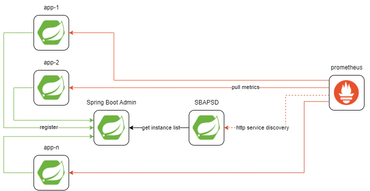

# SBAPSD

## Spring Boot Admin Prometheus Service Discovery

[](https://maven-badges.herokuapp.com/maven-central/com.github.alexey-lapin.sbapsd/sbapsd-server/)

This project offers a method to expose applications registered
within [Spring Boot Admin](https://github.com/codecentric/spring-boot-admin)
for [Prometheus](https://prometheus.io/) [http service discovery](https://prometheus.io/docs/prometheus/latest/configuration/configuration/#http_sd_config).

## Why?

SBAPSD is the perfect solution if you already have a setup with Spring Boot-based applications registered in Spring Boot
Admin and want to introduce a monitoring stack based on Prometheus without manually adding
each instance to the scrape configuration or setting up any other service discovery tool.


The library is tested with Spring Boot Admin v1, v2, v3.

| provider type | v1 | v2 | v3 |
|---------------|----|----|----|
| registry      |    | ✔  | ✔  |
| web           | ✔  | ✔  | ✔  |

## Usage

### As a library

This library is based on Spring Boot and reactive stack (Reactor).

1. Add the `sbapsd-server` dependency

```kotlin
implementation("com.github.alexey-lapin.sbapsd:sbapsd-server:0.0.6")
```

```xml

<dependency>
    <groupId>com.github.alexey-lapin.sbapsd</groupId>
    <artifactId>sbapsd-server</artifactId>
    <version>0.0.6</version>
</dependency>
```

It is also necessary to have spring web stack on classpath e.g. org.springframework.boot:**spring-boot-starter-webflux**
or
org.springframework.boot:**spring-boot-starter-web**

2. Put the `@EnableAdminServerServiceDiscovery` annotation

```java

@SpringBootApplication
@EnableAdminServerServiceDiscovery
public class App {

    public static void main(String[] args) {
        SpringApplication.run(App.class, args);
    }

}
```

3. Add config props - see Configuration section below
4. Customize autoconfigured beans if necessary (see `ServiceDiscoveryAutoConfiguration` class)

### As a standalone app

Grab a jar from
the [releases page](https://github.com/alexey-lapin/spring-boot-admin-prometheus-service-discovery/releases/latest):

- v2 is based on Spring Boot 2 and requires Java 8
- v3 is based on Spring Boot 3 and requires Java 17

and run it like so:

```shell
java -jar sbapsd-standalone-v2-0.0.6.jar
```

or

```shell
java -jar sbapsd-standalone-v3-0.0.6.jar
```

Standalone app is also available as GraalVM native binaries for linux and windows.

### Configuration

Yaml example:

```yml
sbapsd:
  providers:
    server-1:
      type: web
      params:
        url: http://localhost:8091/api/applications # SBA v1
      labels:
        static-label-1: val-1
    server-2:
      type: web
      params:
        url: http://localhost:8092/instances # SBA v2/v3
      filters:
        - type: app-name
          params:
            value: app-[12]
    server-3:
      type: registry
      labels:
        static-label-2: val2
      filters:
        - type: status
          params:
            value: UP,DOWN
```

This example configures 3 providers. They can be queried individually:

`GET http://localhost:8080/service-discovery/prometheus/server-1`

Response:

```json
[
  {
    "targets": [
      "somehost:62140"
    ],
    "labels": {
      "__meta_discovery_app_name": "app-3",
      "__meta_discovery_provider_name": "server-1",
      "__meta_discovery_actuator_path": "/actuator",
      "static-label-1": "val-1"
    }
  },
  {
    "targets": [
      "somehost:62137"
    ],
    "labels": {
      "__meta_discovery_app_name": "app-2",
      "__meta_discovery_provider_name": "server-1",
      "__meta_discovery_actuator_path": "/actuator",
      "static-label-1": "val-1"
    }
  },
  {
    "targets": [
      "somehost:62127",
      "somehost:62131"
    ],
    "labels": {
      "__meta_discovery_app_name": "app-1",
      "__meta_discovery_provider_name": "server-1",
      "__meta_discovery_actuator_path": "/actuator",
      "static-label-1": "val-1"
    }
  }
]
```

`GET http://localhost:8080/service-discovery/prometheus/server-2`

Response:

```json
[
  {
    "targets": [
      "somehost:62137"
    ],
    "labels": {
      "__meta_discovery_provider_name": "server-2",
      "__meta_discovery_app_name": "app-2",
      "__meta_discovery_actuator_path": "/actuator"
    }
  },
  {
    "targets": [
      "somehost:62127",
      "somehost:62131"
    ],
    "labels": {
      "__meta_discovery_provider_name": "server-2",
      "__meta_discovery_app_name": "app-1",
      "__meta_discovery_actuator_path": "/actuator"
    }
  }
]
```

Alternatively, it is possible to query all providers in a single call:

`GET http://localhost:8080/service-discovery/prometheus`

In this case results from all providers are merged in one list.

#### [sbapsd]

Root config

| key        | type |
|------------|------|
| providers* | map  |

#### [server]

Configures the way of how to obtain instances either directly from instance **registry** or via **web**

| key     | type                 |
|---------|----------------------|
| type*   | string: web/registry |
| params  | map                  |
| labels  | map                  |
| filters | list                 |

#### [server.params] (web)

Configures web connectivity

| key      | type   |
|----------|--------|
| url*     | url    |
| username | string |
| password | string |
| insecure | bool   |

#### [filter]

Configures what instances should be exposed

| key    | type                    |
|--------|-------------------------|
| type*  | string: app-name/status |
| params | map                     |

#### [filter.params] (app-name)

Filters instances by spring.application.name

| key    | type           |
|--------|----------------|
| value* | string (regex) |

#### [filter.params] (status)

Filters instances by status (UP, DOWN, OFFLINE, UNKNOWN, OUT_OF_SERVICE)

| key    | type                     |
|--------|--------------------------|
| value* | string (comma-separated) |

### Prometheus configuration

In prometheus config it is possible to use specific server name or omit it to get merged list of instances
from all the configured providers:

- /service-discovery/prometheus/server-1
- /service-discovery/prometheus

The service discovery component contributes a set of labels that can be used during the relabel phase:

- __meta_discovery_app_name
- __meta_discovery_actuator_path
- __meta_discovery_server_name

The example config sets \_\_metrics_path\_\_ and app labels:

```yml
scrape_configs:
  - job_name: "spring"
    http_sd_configs:
      - url: http://localhost:8080/service-discovery/prometheus/server-1
    relabel_configs:
      - source_labels: [ __meta_discovery_actuator_path ]
        target_label: __metrics_path__
        replacement: $1/prometheus
      - source_labels: [ __meta_discovery_app_name ]
        target_label: app
```
